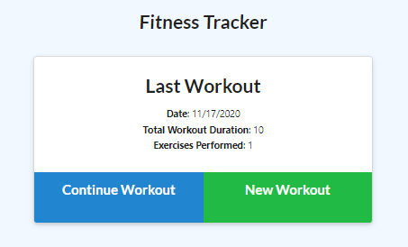
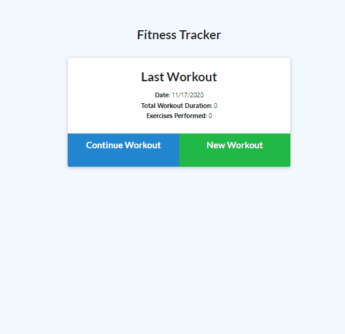
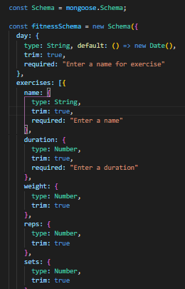
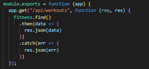
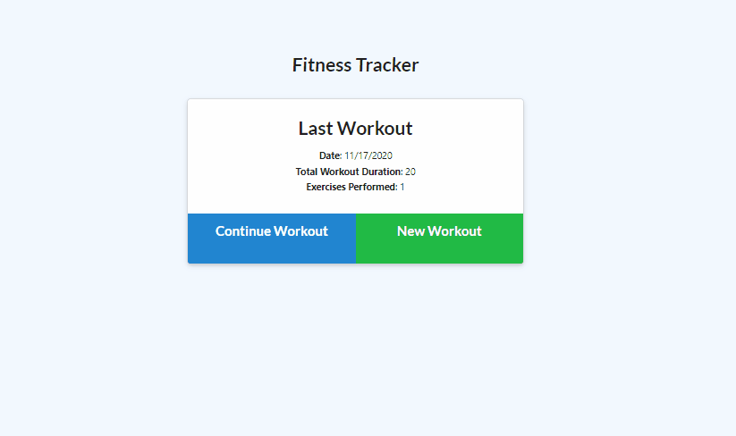

# Workout Tracker

 

This Workout Tracker allows you to document your exercise routines and provides graph data with record of your progress. It utilizes api routes to saved your personalized workouts from your browser and stores your stats in a Mongo database to access upon demand.

## Table of Contents

* [Tech Used](#tech_used)
* [Usage](#usage)
* [Features](#features)
* [Deployed_Link](#deployed_link)
* [Author](#author)
* [License](#license)

----

## Tech Used

* [HTML](https://developer.mozilla.org/en-US/docs/Web/HTML)
* [Javascript](https://developer.mozilla.org/en-US/docs/Web/JavaScript)
* [MongoDB](https://www.mongodb.com/)
* [NPM](https://www.npmjs.com/)
* [Express](https://expressjs.com/)
* [nodeJS](https://nodejs.org/en/)
* [Mongoose](https://mongoosejs.com/docs/)
* [Morgan](https://www.npmjs.com/package/morgan)

## Usage
 
 Users are prompted to select an exercise type, then enter exercise name and perimeters. Users can choose to add additional exercises or complete their workout. Upon completion, workouts are submitted to the fitness dashboard, which users can access to view their metrics.

  

## Features

- Utilizes Mongoose to set the format of the database. 

  

- Express manages the api routes to GET and POST data to and from the database...

  

- ... and return that data to the browser.

  

## Deployed Link

* [See Live Site](https://still-brook-83003.herokuapp.com/)

---

## Author

**AJ Huff** 

- [Portfolio Site](https://stark-mesa-37630.herokuapp.com/)
- [Github](https://github.com/ajhuff7)
- [LinkedIn](https://www.linkedin.com/in/aj-huff-7696b14b/)

## License

 